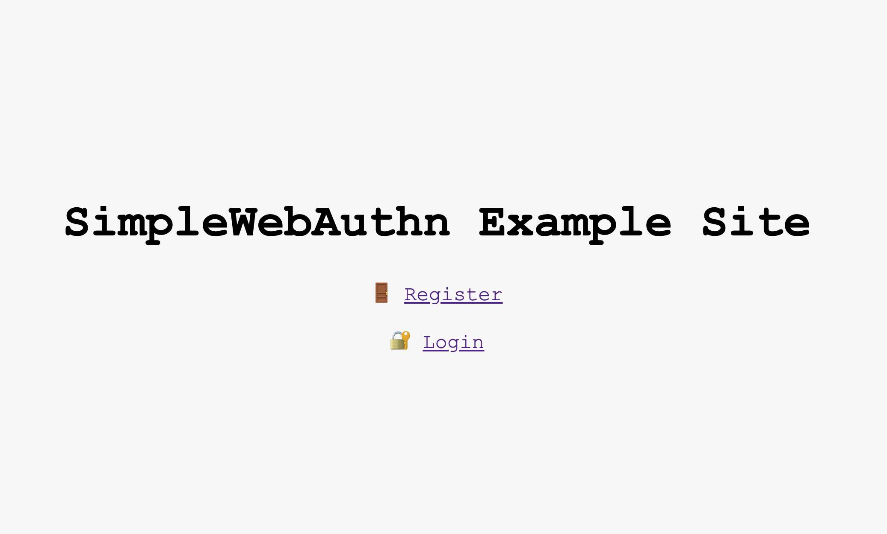
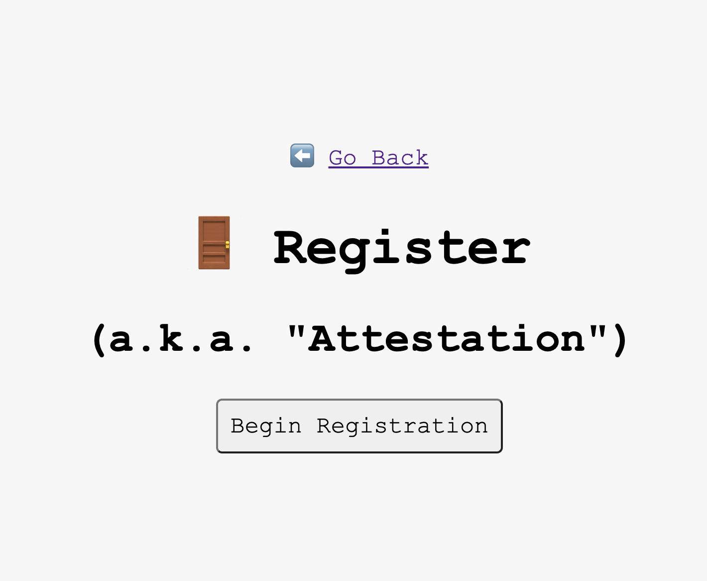
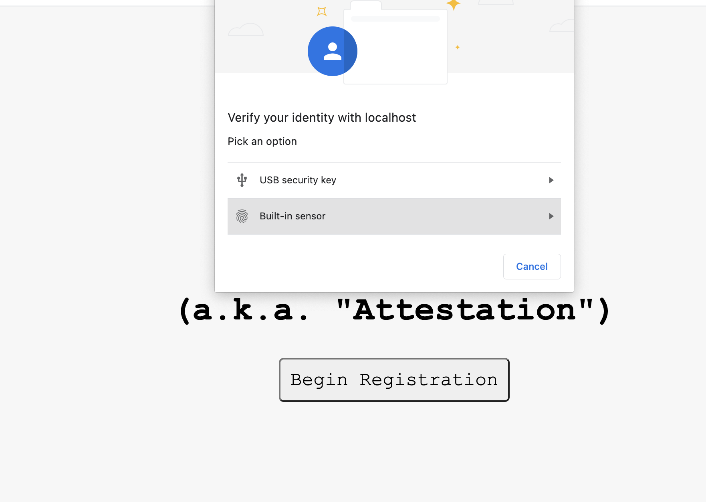
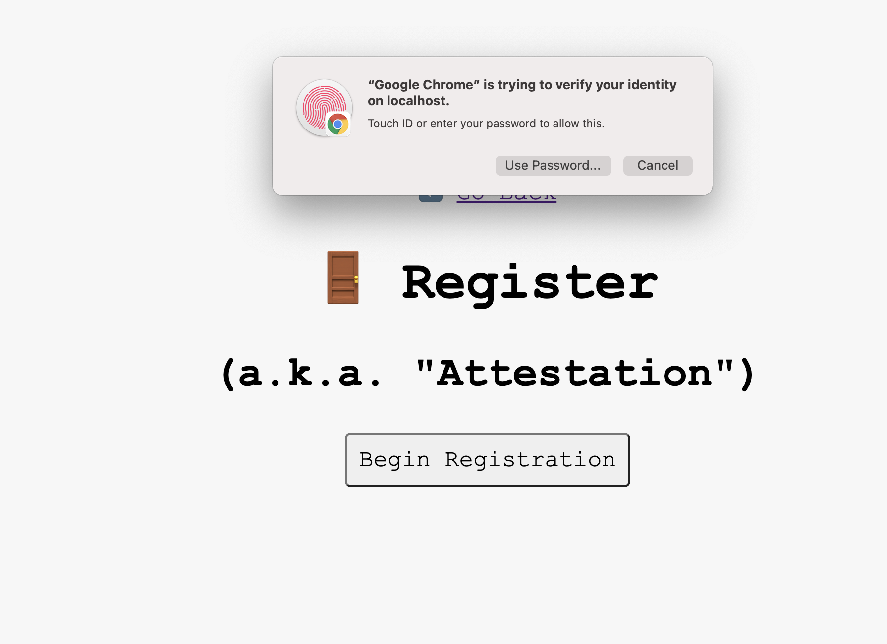
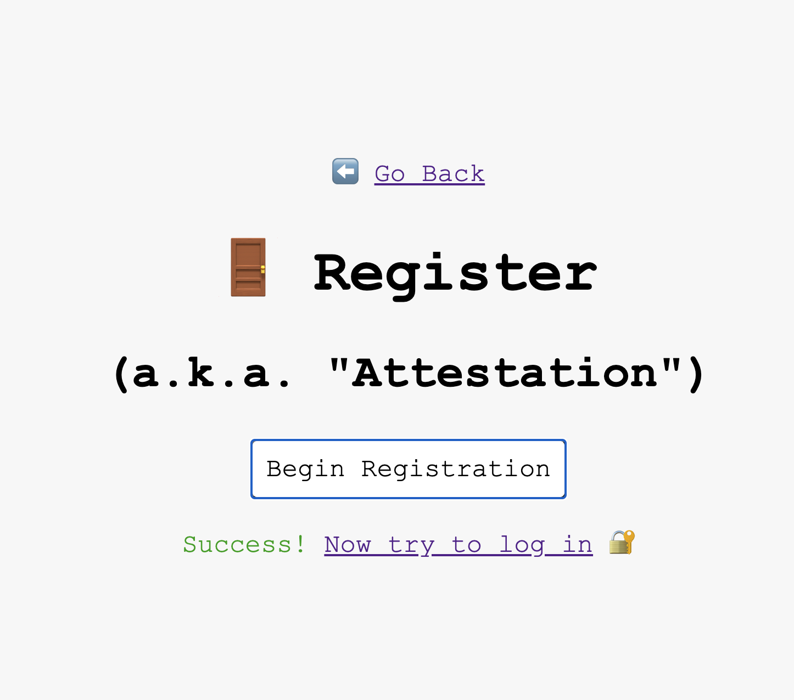

# Here are the summary notes
## Overview of how it works
Touch Id authentication works on using a new web standard called Web Authentication API that has been implemented in certain browsers (see supprted devices below).  the Web Authentication Standard uses a public-private key as a credential to authenticate users onto a site.  When a user first registers with a site the browser will create a public-private key pair.  The public key is then transmitted to ther server (during registration) and is stored on the server (i.e. database).  When the user attempts to login into the site again, the browser will submit the public key to the server and it will check to ensure that it is valid.   

## What are security options
### username/password

-- users need to worry about them being stolen by phising tools
-- users are worried that they might be leaked online if the site is hacked
-- Main problem with password is that it is a shared secret (i.e. between the user and the website).  So if it is stolen from the server they have their password. 

- web auth
It allows servers to integrate with strong authenticates no in devices (Apple Touch Id).  It uses a private-public keypair (known as credential) for a website.  The private key is stored securly on the user's device.  A public key and a randomly generated credential ID is sent to the server for storage.  The server then uses the public key to provde the user's identifie


### Part 1 - Generate Attestation Options
The first part is to generate the attestation options (used before the registration option).  It will provide the following key elements:
- challenge - random number generated on the server
- reply party - Authenticator
- timeout
- public Key Credential Parameters -- An Array of Public Key Credniatial Types that are acceptable on the server.  Notes: alg -- described in the COSE Registration

### Part 2 - Verify Attestation - i.e. (Registration)

The client will generate a public key.  To generate a key it needs the following information

-- challenge - from server
-- userId
-- id ? - Is the ID for the uniquely generated Id
-- response ?
---- clientDataJSON - Contains type, origin, challenge - This was passed from the server
---- attestationObject - The Public Key
-- type ?


### Part 3 - Verify Assertion - i.e. (Login)

### Assertion Options
-- Pass in the user Id
-- Get the Challenge Id
-- Get the Unique ID of the credential based on the user name

### Assertation Verify
-- Pass the public key to -- Which includes the challenge and the id of the credentials

```
  const credential = (await navigator.credentials.get({ publicKey })) as AssertionCredential;
```

### Verify the assertation on the server

-- Does a look of the public key and does a verification

Assertaion Verify
## Client(Device) side work.  How does the encryption process work

## Registration Process

## Authentication Process

## Initial findings
I did some investigation on how to use the touch id with the login and it seems possible; however, there are a couple of caviates.  The first thing is that it is not fully supported across all browsers (see the list below of supprted browsers).  The second is that I have not seen a lot of production ready implementations in place yet (i.e. specifically for touch id); however, I have seen multiple open source implementations that we could leverage if we wanted to implement out own.  The implementation will require both some UI changes as well as some changes to the downstream

## Supported 
The following is an updated list of the different browsers that current support Touch ID as well as other secure log in mechanisms

https://simplewebauthn.dev/docs/advanced/supported-devices

## Implementation Notes

### UI Changes
To take advantage of the UI changes, it rely's on browsers that support the Web Authentication API.  From some of the code that I have seen it is possible to detect which browsers support this feature and it should be straight forward for us to enable this for certain browsers.

The following is a sample UI implementation that I was able to play with

The following is a sample 

The User will click on the register button


The User will select authentication mechanism


The User will enter their touch id


The User will allow touch Id to be used


Confirmation of Registration


## Supported libraries

Simple Webauthn
https://simplewebauthn.dev/docs/advanced/example-project

WebAuthn Guide
https://webauthn.guide/

Webauth.io
https://webauthn.io/

Java Sample Project
https://github.com/duo-labs/android-webauthn-authenticator

Java Sample Project - Google
https://github.com/google/webauthndemo

Java Sample Project - 
https://github.com/Yubico/java-webauthn-server

Javascript Sample Project
https://github.com/fido-alliance/webauthn-demo
